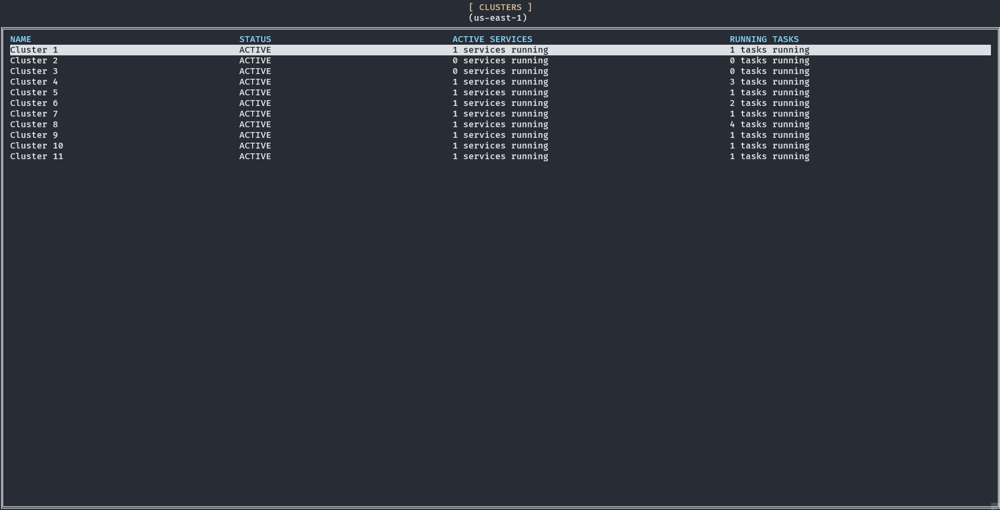

# ecsplorer
[](https://github.com/masaushi/ecsplorer/actions/workflows/release.yml)
[](https://github.com/masaushi/ecsplorer/actions/workflows/lint.yml)

ecsplorer is a tool designed for easy CLI operations with AWS ECS.



## Overview
This tool serves as a CLI utility to efficiently manage AWS ECS resources and services. It provides support for ECS operations through simple commands.

## Key Features
- Retrieve lists of ECS resources
- Exec into containers

## Installation
### Download binary
Binaries for Windows, MacOS and Linux are available in the [release](https://github.com/masaushi/ecsplorer/releases) page.

### via Homebrew for macOS or Linux
```sh
brew install masaushi/tap/ecsplorer
```

### via Go install
#### Go version < 1.16
```sh
go get github.com/masaushi/ecsplorer
```

#### Go 1.16+
```sh
go install github.com/masaushi/ecsplorer@latest
```

### Usage
After installation, you can launch a terminal UI by executing the `ecsplorer` command.

```sh
ecsplorer
```

#### specify profile
You can specify a profile from your `.aws/config` by using the `--profile=<profile name>` option or setting the AWS_PROFILE=<profile name> environment variable.

```sh
ecsplorer --profile=<profile>
```
or
```sh
AWS_PROFILE=<profile> ecsplorer
```

### :warning: Note :warning:
If you intend to exec into containers, please ensure that the [session-manager-plugin](https://docs.aws.amazon.com/systems-manager/latest/userguide/session-manager-working-with-install-plugin.html) is installed.

## License
Released under the MIT license.
